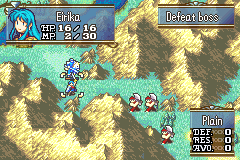

# Anima Triangle

  

---

## 📑 Index
- [Introduction](#introduction)
- [Plan](#plan)
- [Code Locations](#code-locations)
- [TODO](#todo)
- [Limitations & Bugs](#limitations--bugs)

---

## 🧩 Introduction

``CONFIG_ANIMA_WEAPON_TRIANGLE``

This feature recreates the **anima magic triangle** from **Fire Emblem 4 and 5**, where anima spells interact with one another similarly to traditional weapon and magic triangles.

---

## 🛠️ Plan

The system follows the classic FE4/FE5 structure:

- **Fire → Wind/Ice**
- **Wind/Ice → Thunder**
- **Thunder → Fire**

The configuration supports **up to three anima types**, arranged in a triangular advantage/disadvantage relationship.

---

## 🗂️ Code Locations

| Feature | Location | Description |
|--------|----------|-------------|
| **Anima storage struct** | `weaponId_1` and `weaponId_2` in `WeaponTriangleItemConf` in [`battle-system.h`](../../include/kernel/battle-system.h) | Defines anima weapon IDs involved in triangle |
| **Triangle relationships & bonuses** | `gWeaponTriangleItemConf` in [`WeaponTriangle.c`](../../Data/BattleSys/Source/WeaponTriangle.c) | Holds triangle rules and hit/damage bonuses |
| **WTA logic** | `WTA_HandlerWeapon` (inside `#ifdef CONFIG_ANIMA_WEAPON_TRIANGLE`) in [`WeaponTriangle.c`](../../Kernel/Wizardry/Core/BattleSys/Source/WeaponTriangle.c) | Applies the triangle logic during combat |

---

## 📝 TODO

_Add items when identified._

---

## 🐛 Limitations & Bugs

Please report issues in the repository’s **Issues** tab.

### ⚠️ Known Concern

- There may be **slight lag** when this system is active.  
  It’s not disruptive, but worth monitoring for future optimization.

---
