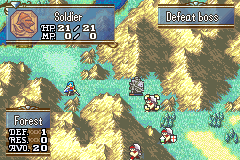

# Enemies Promote When Killing a Unit

  

---

## 📑 Index
- [Introduction](#introduction)
- [Plan](#plan)
- [Code Locations](#code-locations)
- [TODO](#todo)
- [Limitations & Bugs](#limitations--bugs)

---

## 🧩 Introduction

`CONFIG_PROMOTE_ENEMIES_IF_KILLED_UNIT`

Inspired by the **Shiren the Wanderer** DS games, this feature allows enemy units to **promote** when they successfully kill one of your units.

If the enemy has at least one valid promotion option, they immediately transform into their promoted class—granting them their promotion bonuses and custom bonuses on top (by default an omni boost of +3 determined by the value of     ``ONFIG_ENEMY_PROMOTION_BOOST``).

---

## 🛠️ Plan

When an enemy unit defeats a player unit:

- If the enemy has **promotion options**, they automatically promote  
- They gain flat stat boosts (default: **+3 to all stats**)  
- The boost amount can be modified using:  ``CONFIG_ENEMY_PROMOTION_BOOST``

This creates dynamic, high-tension gameplay: careless unit deaths now empower the enemy forces.

---

## 🗂️ Code Locations

| Feature | Location | Description |
|--------|----------|-------------|
| **Enemy promotion logic** | `CONFIG_PROMOTE_ENEMIES_IF_KILLED_UNIT` section inside `BattleGenerateHit` — [`BattleHit.c`](../../Kernel/Wizardry/Core/BattleSys/Source/BattleHit.c) | Handles enemy auto-promotion after killing a player unit |

---

## 📝 TODO

- Allow enemies with **multiple promotion paths** to pick randomly  
- Enemies who are **already promoted** should still gain stat boosts  
- Add a **special animation** or visual indicator when promotion occurs  
- Make stat gains **modular**, randomized, or defined via a struct  

---

## 🐛 Limitations & Bugs

Please report issues or enhancement requests in the repository’s **Issues** tab.

---

