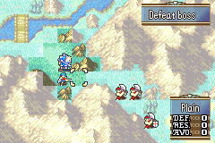

# Make Fog Great Again!

<p align="center">
  
</p>

---

## 📑 Index
- [Introduction](#introduction)
- [Plan](#plan)
- [Code Locations](#code-locations)
- [TODO](#todo)
- [Limitations & Bugs](#limitations--bugs)

---

## 🧩 Introduction

This project aims to make **fog of war** a more strategic and engaging gameplay element.

Historically, fog has been a controversial mechanic in Fire Emblem.  
Its default GBA implementation contradicts core strategy design principles: players are expected to make informed decisions based on map information, yet fog removes information and penalizes players for guessing wrong.

Vanilla fog issues include:

- Enemy units outside a unit’s sight radius are completely hidden  
- Running into hidden enemies **ends your turn immediately**  
- Enemy units enjoy unfair omniscient vision of the entire map  

This system seeks to address those problems.

---

## 🛠️ Plan

To improve fog, this redesign introduces **three distinct fog stages**:

```
        3
      3 2 3
    3 2 1 2 3
  3 2 1 0 1 2 3
3 2 1 0 U 0 1 2 3
  3 2 1 0 1 2 3
    3 2 1 2 3
      3 2 3
        3
```


### How It Works

| Stage | Visibility | Description |
|-------|------------|-------------|
| **U** | — | Player unit position |
| **0** | Full visibility | Enemy fully visible (stats, forecast, everything) |
| **1** | Limited info | Enemy visible, but stats/MMB/forecast are hidden |
| **2** | Low clarity | Enemy replaced with a neutral **citizen sprite** (identity obscured) |
| **3** | Full fog | Enemy completely hidden (as in vanilla), terrain also obscured |

This layered fog provides partial information instead of the all-or-nothing approach of vanilla fog, leading to more strategic decision-making.

---

## 🗂️ Code Locations

All modifications are gated behind the `CONFIG_MULTIPLE_FOG_STAGES` preprocessor flag.

| Feature | Location | Description |
|--------|----------|-------------|
| **Stat screen accessibility** | `CanShowUnitStatScreen` and `FindNextUnit` in [`AccessStatScreen.c`](../../Data/StatScreen/Source/AccessStatScreen.c) | Controls whether a fog-obscured unit’s stats may be viewed |
| **Fog-based unit hiding** | `RefreshUnitsOnBmMap` in [`MiscFunctions.c`](../../Kernel/Wizardry/Misc/MiscFunctions/Source/MiscFunctions.c) | Determines if an enemy should be visually hidden |
| **Battle forecast data visibility** | `DrawBattleForecastContentsStandard` and `DrawBattleForecastContentsExtended` in [`BattleForecast.c`](../../Kernel/Wizardry/Core/CombatArt/BKSELfx/Source/BattleForcast.c) | Determines whether enemy stats appear in the forecast |

---

## 📝 TODO

- Expand mechanical and graphical functionality of **stages 2 and 3**
- Resolve issues involving **multiple fog overlays** sharing a single layer
- Optimize palette usage (must stay under 16 colors)

---

## 🐛 Limitations & Bugs

Currently, stages **2** and **3** are incomplete and require further development.  
There are technical challenges around rendering multiple fog layers simultaneously. Ideally, all fog patterns should programmatically coexist as long as the palette remains within hardware limits.

Please report any issues in the repository’s **Issues** tab.

---
