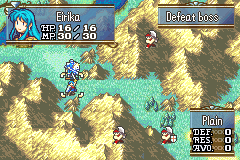

# Laguz Bars

  

---

## 📑 Index
- [Introduction](#introduction)
- [Plan](#plan)
- [Code Locations](#code-locations)
- [TODO](#todo)
- [Limitations & Bugs](#limitations--bugs)

---

## 🧩 Introduction

`CONFIG_LAGUZ_BARS`

Originally developed by **Sme**, this is a C-based recreation of their **Laguz Bars** hack.

In FE9/FE10, certain units possessed a **Laguz meter** that filled over time.  
When full, the unit could transform—gaining powerful combat bonuses until the bar depleted.  
This system brings that mechanic into the GBA engine.

---

## 🛠️ Plan

This implementation follows the structure of the Tellius games:

- A new **Laguz Bar** is added to the stat screen
- When the bar is filled, the unit gains a **Transform** command (does not end turn)
- Bar values are stored using **BWL data**, meaning only the **first 51 playable units** can use Laguz bars

### Default Rules

- Total bar size: **30**
- Starting value: **10**
- When untransformed: **+2 per turn**
- When transformed: **–4 per turn**
- Units **gain no bar** while transformed
- Units **auto-revert** when the bar hits 0
- Units always **revert at map end**

---

## 🗂️ Code Locations

| Feature | Location | Description |
|--------|----------|-------------|
| **Transform usability & effects** | `Transform_Laguz_Usability`, `Transform_Laguz_OnSelected` in `Transform_Laguz_Effect` — [`Laguz.c`](../../Kernel/Wizardry/Misc/SkillEffects/MenuSkills/Laguz.c) | Handles transform command behavior |
| **Auto-revert at map end** | `ChapterChangeUnitCleanup` — [`UnitRefrain.c`](../../Kernel/Wizardry/Common/UnitHooks/Source/UnitRefrain.c) | Resets Laguz bars (and other settings) at chapter transition |
| **Drawing the Laguz Bar** | `DrawPage1LaguzBar` — [`Page1WithBwl.c`](../../Kernel/Wizardry/Core/StatScreen/DrawUnitPage/PlanA/Page1WithBwl.c) | Renders the bar on the stat screen |
| **Stat boosts / penalties** | `PrePhase_LaguzBars` — [`PrePhase_LaguzBars.c`](../../Kernel/Wizardry/Misc/SkillEffects/PrePhaseSkills/PrePhase_LaguzBars.c) | Applies transformed/untransformed stat changes |

---

## 📝 TODO

- Add a **configurable struct** allowing:
  - Per-unit custom starting values  
  - Per-unit or per-class fill/decay rates  
  - More fine-grained transformation tuning  

---

## 🐛 Limitations & Bugs

Please report issues in the repository’s **Issues** tab.

### Known Issue

- Enabling Laguz Bars **alongside the MP system** currently causes conflicts, even though each system uses different bytes within the BWL struct.  
  Investigation pending…

---
