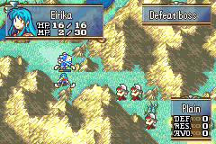

# MP System

##  Index 
- ### [Introduction](#Introduction)
- ### [Plan](#Plan)
- ### [Code Locations](#Code-Locations)
- ### [TODO](#TODO)
- ### [Limitations and Bugs](#Limitations-and-Bugs)

## Introduction

This builds on Mokha's implementation of the FE Gaiden magic system.
By default, Gaiden Magic is split into "Black" and "White" categories
and costs a set amount of HP to cast. Given the importance of HP as  a resource
in a game where enemies are stacked against you, this setup is less than ideal.

## Plan

This hack implements a functional MP system for every playable unit with BWL data,
storing both their current MP and max MP in their BWL structs. C Skill System limits
this to 51 units instead of 0x46 in the base game (presumably to free up the RAM for other things).

The MP system follows FFTA2 rules. For those unfamiliar, this means your units
start at 0 MP each map and gain X amount per turn and/or battle. The idea behind this is
in return for making MP a self replenishing resource, you're unable to fire off
your most powerful Gaiden magic straight away.

In addition, a stat page has been fashioned to display all white/black gaiden magic
alongside their MP costs. The default system tried to display them in the item page,
which quickly becomes a problem when you're running with a full stock.

## Code Locations

### MP costs
 ``gGaidenWeaponCostList`` in [GaidenMagicData.c](../../Data/GaidenMagic/GaidenMagicData.c)
### MP lists
``gGaidenPinfoConfigList`` in [GaidenMagicData.c](../../Data/GaidenMagic/GaidenMagicData.c)
### Stat screen display - MP cost color
``PutGaidenCost`` in [DrawPage5.c](../../Kernel/Wizardry/Core/StatScreen/DrawPages/DrawPage5.c)
### Stat screen display - white Gaiden magic
``WhiteMagicList`` in [DrawPage5.c](../../Kernel/Wizardry/Core/StatScreen/DrawPages/DrawPage5.c)
### Stat screen display - black Gaiden magic
``BlackMagicList`` in [DrawPage5.c](../../Kernel/Wizardry/Core/StatScreen/DrawPages/DrawPage5.c)
### MP generation
``gMpSystemPInfoConfigList`` in [MpSystem.c](../../Data/MpSystem/MpSystem.c)

## TODO

- Switch from MMB to GORGON-EGG for MP display in the minimug box
- Add an option for 3 houses magic
- Add an option for FFTA MP rules alongside the current FFTA2

## Limitations/Bugs

Report in the ``issues`` tab of the repo.

- Getters for the current MP and max MP have been created in [MiscFunctions.c](../../Kernel/Wizardry/Misc/MiscFunctions/Source/MiscFunctions.c)
  ``GetUnitCurrentMP`` and ``GetUnitMaxMP``, however these are not very compatible with the [MMBDrawMP.s](../../Kernel/Wizardry//Misc/ModularMinimugBox/Modules/MMBDrawMP.s)
  which draws the MP inside the Minimug box on the map. This makes it hard for the MP to be dynamic outside of what's set in the ROM. It's possible GORGON-EGG might be able
  to fix this, as I think that one uses C, but we'll see.
