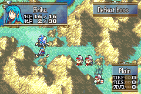

# Stat Screen - Promotions

##  Index 
- ### [Introduction](#Introduction)
- ### [Plan](#Plan)
- ### [Code Locations](#Code-Locations)
- ### [How To Modify](#How-To-Modify)
- ### [Limitations and Bugs](#Limitations-and-Bugs)

## Introduction

By default, it can be annoying to work out what classes promote to what. Historially, this information has generally been obscured from the player, making promotion paths a bit of guessing game. Finding out the answers usually requires either getting the required promotion items, hitting certain story/event milestones or digging into the source files of the page.

## Plan

This page seeks to remedy that and allow you to display a modular list of promotion options for the active unit alongside and acquired skills from those promotions.

As of the current version, you have up to 3 promotion options and 3 skills per promotion displayed within the page, with r text enabled to help you make a more informed decision later down the road.

## Code Locations

- The redirection of the R text is controlled within ``HbRedirect_SSItem`` inside the ``CONFIG_STAT_PAGE_PROMOTIONS`` definition inside [DrawItemPage.c](../../Kernel/Wizardry/Core/StatScreen/DrawItemPage.c).

- The display of the SMS (standing map sprites) and the platforms are controlled in ``PageNumCtrl_DisplayMuPlatform`` in [DrawMorePage.c](../../Kernel/Wizardry/Core/StatScreen/DrawMorePage/Source/DrawMorePage.c)

- The array that holds the promotion data is ``unit_promotions`` as well as what draws the skill icons ``DrawPage7Rework`` are both contained in [DrawPage7.c](../../Kernel/Wizardry/Core/StatScreen/DrawPages/DrawPage7.c)

- The redirection logic for the R text is controlled in [HelpBoxPage7.c](../../Kernel/Wizardry/Core/StatScreen/DrawPages/HelpBoxPage7.c)

- The sprite sheet for the page numbers and titles is in [Gfx_StatScreenObj_9Pages.png](../../Data/StatScreen/Data/Gfx_StatScreenObj_9pages.png) and is controlled by ``DisplayPageNameSprite`` and ``PageNumCtrl_UpdatePageNum.c`` in [DrawMorePage.c](../../Kernel/Wizardry/Core/StatScreen/DrawMorePage/Source/DrawMorePage.c).

## How To Modify

To edit the promotion options on a per-unit basis you'll want to navigate to [DrawPage7.c](../../Kernel/Wizardry/Core/StatScreen/DrawPages/DrawPage7.c). Inside ``unit_promotions`` is a variable width macros called ``UNIT_PROMOS`` that takes a unit character ID as a key, and a number of ``PROMO`` macros between 1-3. The ``PROMO`` macros themselves take a class ID and a variable number of skill IDs between 0-3. The list is terminated with ``{0}`` do not remove it.

## Limitations/Bugs

- There is a problem in [DrawItemPage.c](../../Kernel/Wizardry/Core/StatScreen/DrawItemPage.c) inside ``HbRedirect_SSItem`` where I've attempted to turn off the R text option for promotion locations the unit isn't using (e.g. they only have 2 promotions instead of 3). However, there doesn't seem to be a bulletproof way of disabling R text in this situation when transitioning around the page with the DPAD. Right now, the best I've been able to do is disable R text when you try to enable it directly on an unused space on the page.

- Some logic expects this page to be 7th in ``gStatScreen.page`` (which as a 0 based index would be 6). So the MP system and personal info stat pages will need to be enabled or certain things might not work correctly. At some point I'll look into solving this.

Report any further issues in the [issues](https://github.com/JesterWizard/C-SkillSystem-Mokha/issues) tab of the repo.
