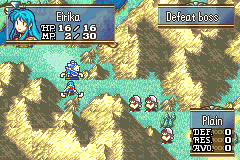

# Tellius Skill Capacity

  

---

## 📑 Index
- [Introduction](#introduction)
- [Plan](#plan)
- [Code Locations](#code-locations)
- [TODO](#todo)
- [Limitations & Bugs](#limitations--bugs)

---

## 🧩 Introduction

One thing I've never really seen any GBA hacks do is introduce a **skill capacity system**.  
This project implements one.

For those unfamiliar, skill capacity is a concept introduced in the **Tellius games (FE9/FE10)**.  
It adds another strategic layer to skill assignment by giving each unit:

- A **capacity meter**
- Each skill a **capacity cost**

Even if a unit has an empty skill slot, the **remaining capacity** must be high enough to equip the skill.  
This forces players to consider meaningful tradeoffs instead of stacking many powerful skills on a single unit.

---

## 🛠️ Plan

The system works as follows:

### ✔️ Skill Rules
- Every **skill** receives a **capacity cost**

### ✔️ Unit Rules
- Every **unit** starts with **50 capacity**
- Promoted units gain **+25 capacity**

### ✔️ Learning Rules
- A unit **cannot learn a skill** if it would exceed their remaining capacity

---

## 🗂️ Code Locations

| Feature | Location | Description |
|--------|----------|-------------|
| **Skill capacity definitions** | [`Skills_Capacity.h`](../../include/kernel/Skills_Capacity.h) | Defines capacity values per skill |
| **Skill capacity getter** | `GetSkillCapacity(u16 sid)` in [`Infos.c`](../../Kernel/Wizardry/Core/SkillSys/kernel/Infos.c) | Retrieves a skill’s capacity cost |
| **Scroll usability + capacity check** | `ItemUseAction_SkillScroll` in [`SkillScroll.c`](../../Kernel/Wizardry/Core/SkillSys/SkillScroll/Source/SkillScroll.c) | Prevents scroll use when over capacity |

---

## 📝 TODO

_Add items as discovered._

---

## 🐛 Limitations & Bugs

Please report any issues in the repository’s **Issues** tab.

### ⚠️ Known Concerns

#### 1. Capacity-reducing skills may cause overflow conditions  
Some skills reduce the capacity required for other skills.  
If the reducing skill is removed, the unit may remain **over capacity** yet still retain skills they normally could not equip.

This is currently unresolved.

#### 2. Level-up / event-learned skills bypass capacity checks  
Currently, only scroll-based learning checks capacity.  
Skills learned through:
- Level-ups  
- Event scripts  
- Other systems  

…may exceed capacity without restriction.

A global learning hook might be needed.

---
